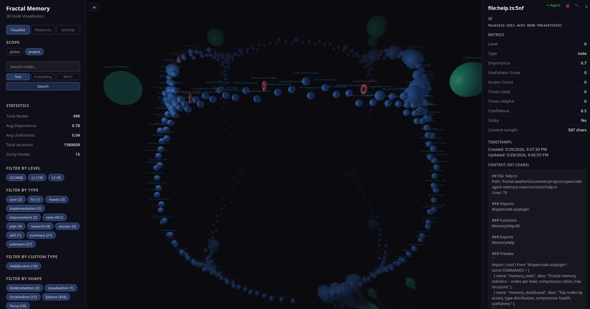

# opencode-fractal-memory

Fractal memory system for [OpenCode](https://opencode.ai) with semantic search, automatic compression, and multi-level retrieval.

## Features

- **Memory nodes** — structured persistent memory with labels, content, metadata, and type system
- **Semantic search** — ONNX-powered embeddings (all-MiniLM-L6-v2) with HNSW vector index for fast ANN retrieval
- **BM25 full-text search** — keyword search as a fallback, hybrid-scored with embeddings for best results
- **Fractal retrieval** — drill-down from high-level summaries to granular details
- **Automatic compression** — periodically summarizes low-level nodes into progressively higher-level abstractions (4 levels)
- **Auto-retrieve** — context-aware injection of relevant memories into the prompt
- **Journal** — append-only searchable journal entries with semantic search
- **Playbooks** — reusable workflow templates discovered and executed by the agent
- **Management server** — local web UI (port 8787) for browsing and editing memory

## Installation

### For OpenCode users

Add the plugin name to `~/.config/opencode/opencode.json`:

```json
{
  "plugins": ["opencode-fractal-memory"]
}
```

OpenCode installs it automatically at startup. Model files (~24 MB) download on first plugin load via `ensureModels()` — no manual steps needed.

### For development / manual install

```bash
npm install opencode-fractal-memory
```

Models download on first run. Use `--ignore-scripts` if installing via Bun (Bun skips lifecycle scripts).

### MCP server setup

```json
{
  "plugins": ["opencode-fractal-memory"],
  "mcp": {
    "fractal-memory": {
      "type": "local",
      "command": ["bun", "run", "<path-to-plugin>/dist/mcp-server.js"],
      "enabled": true
    }
  }
}
```

## Configuration

Create `~/.config/opencode/opencode-mem.json` to customize:

```json
{
  "autoRetrieve": {
    "enabled": true,
    "maxTokens": 2000,
    "highContextThreshold": 0.7,
    "criticalContextThreshold": 0.85
  },
  "ollama": {
    "enabled": false,
    "model": "qwen2.5-coder:1.5b"
  },
  "llmCompression": {
    "enabled": false,
    "maxSummaryTokens": 500
  },
  "cacheSize": 100,
  "cacheTTLHours": 24
}
```

## Commands

### Memory tools

| Command | Description |
|---|---|
| `memory_set` | Create or update a memory node |
| `memory_get` | Get a single node by ID or label |
| `memory_search` | Search nodes by text, embedding, or BM25 |
| `memory_delete` | Delete a node by ID or label |
| `memory_list` | List nodes with optional scope/level filters |
| `memory_inject` | Inject relevant memories into the prompt with token budgeting |
| `memory_drilldown` | Retrieve a node with its source chain (fractal retrieval) |
| `memory_stats` | Show memory statistics (nodes per level, compression ratios) |
| `memory_compress` | Compress old nodes into higher-level summaries |
| `memory_extract_patterns` | Extract cross-topic pattern summaries |
| `memory_check_context` | Check token usage of memory nodes |
| `memory_total_tokens` | Complete token analysis (memory + conversation) |
| `memory_generate_embeddings` | Generate embeddings for nodes that lack them |
| `memory_skill_load` | Load a skill's instructions by name |
| `memory_playbook_execute` | Execute a playbook workflow |
| `memory_injection_debug` | Show what was injected in the last session |
| `memory_verify` | Verify that a node's information is correct |
| `memory_reflect` | Analyze a session and create lesson nodes |

### Playbook tools

| Command | Description |
|---|---|
| `memory_playbook_execute` | Execute a playbook (returns steps for the agent to run) |

Playbooks are stored as `type: "playbook"` memory nodes with steps in `metadata`. CRUD uses generic `memory_set` / `memory_get` / `memory_search` tools. The agent proposes playbooks when it spots repeated multi-step patterns.

### Journal tools

| Command | Description |
|---|---|
| `journal_write` | Write a new journal entry |
| `journal_read` | Read a journal entry by ID |
| `journal_search` | Search journal entries semantically |

### MCP tools

When the MCP server is configured, the `memory_search`, `memory_get`, and related tools are available as MCP resources for IDE integration.

## Skills

Skills are specialized instruction sets stored as memory nodes. When a task matches a skill's trigger keywords, its instructions load into context to guide the agent.

### Available skills

| Skill | Triggers |
|---|---|
| `debug-workflow` | bug, error, fix, crash |
| `write-tests` | tests, coverage, test suites |
| `refactor-component` | refactor, restructure, clean up |
| `refactoring-expert` | SOLID, code smell, technical debt |
| `security-review` | security, audit, vulnerability, deploy |
| `threejs-skills` | 3D, WebGL, visualization |
| `svelte-core-bestpractices` | svelte, component, runes |
| `svelte-code-writer` | svelte 5, sveltekit, component |
| `customize-opencode` | opencode config, agent, plugin |

### Loading a skill

```ts
memory_skill_load(name="debug-workflow")
```

Skills are auto-injected when triggers match the task context. You can also load them explicitly with `memory_skill_load`.

### Creating a skill

Skills are memory nodes with `type: "skill"`. Create one with:

```ts
memory_set(
  label: "skill:my-skill",
  content: "## Skill instructions...",
  type: "skill",
  metadata: JSON.stringify({ triggers: ["keyword1", "keyword2"] }),
  sticky: true
)
```

## Management App

A local web UI for browsing, searching, and editing memory — available when the plugin is active.

### Starting

```bash
bun run view
```

Opens at [http://localhost:8787](http://localhost:8787).

### Features



- **3D graph visualization** — nodes arranged by type and connected by links, draggable and zoomable
- **Search** — search nodes by label or content
- **Inspect** — click any node to see full content, metadata, and embeddings
- **Edit** — update node content, summary, importance, and type
- **Manage** — view the full node tree with level, access count, and timestamps

The management server starts automatically when the plugin loads in OpenCode. Use `bun run view` to open it in a browser outside of OpenCode.

## Development

```bash
git clone <repo>
cd opencode-fractal-memory
bun install
bun run build
bun run typecheck
```

### Testing

```bash
bun test
```

### Installing locally (development)

```bash
bun run build
npm pack
cd ~/.config/opencode
rm -rf node_modules/opencode-fractal-memory package-lock.json
npm install --ignore-scripts <path-to-tgz>
```

Use `--ignore-scripts` to avoid trust prompts. Models download automatically on first plugin load via `ensureModels()` in `initStorage()`.

## Architecture

```
┌──────────────────────────────────────────────────┐
│  Plugin Layer (plugin/index.ts)                   │
│  ┌──────────┬──────────┬──────────┬───────────┐  │
│  │ Memory    │ Skills   │ Journal  │ Auto-     │  │
│  │ Store     │ (nodes)  │ Store    │ Retrieve  │  │
│  └────┬─────┴────┬─────┴────┬─────┴─────┬─────┘  │
│       │          │          │           │         │
│  ┌────┴──────────┴──────────┴───────────┴─────┐  │
│  │ SQLite (.opencode/memory.db)                │  │
│  │  - memory_nodes (labels, content, embeds)   │  │
│  │    - type: "note" / "skill" / "playbook"   │  │
│  │    - sticky playbooks/skills never pruned   │  │
│  │    - metadata.steps for playbook steps      │  │
│  │  - memory_links (wiki-link crossrefs)       │  │
│  │  - bm25_index (full-text search)            │  │
│  │  - injection_metrics / session_metrics      │  │
│  └─────────────────────────────────────────────┘  │
│                                                   │
│  ┌─────────────────────────────────────────────┐  │
│  │ HNSW Vector Index (in-memory, 384-dim)      │  │
│  └─────────────────────────────────────────────┘  │
│                                                   │
│  ┌─────────────────────────────────────────────┐  │
│  │ ONNX Embedding Model (all-MiniLM-L6-v2)     │  │
│  │ onnxruntime-web + @huggingface/tokenizers   │  │
│  └─────────────────────────────────────────────┘  │
└──────────────────────────────────────────────────┘
```

## Storage

Two SQLite databases:

| Scope | Path | Purpose |
|---|---|---|
| Global | `~/.config/opencode/memory.db` | Rules, persona, preferences, shared across projects |
| Project | `<project>/.opencode/memory.db` | Project-specific memory, nodes, playbooks, journal |

## License

MIT
